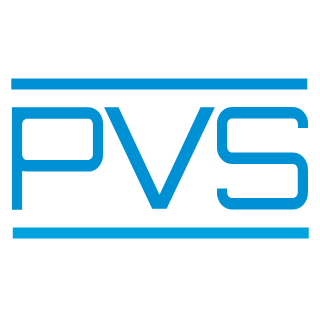

Requirements
==
* [Node.js](https://nodejs.org)
* [Visual Studio Code](https://code.visualstudio.com)

Installation
==
* In Visual Studio Code, go to Preferences/Extensions and select "Install from VSIX".
In the file finder window, browse for the file releases/vscode-pvs-x.x.x.vsix

PVS 7.0
==
* Get PVS 7.0 from http://www.csl.sri.com/users/owre/drop/pvs-snapshots
* After untaring unzipping the PVS distribution file, run the script
```
$./install-sh
```

* Clone the pvslib repository and checkout the branch pvs7.0
```
$ git clone git@gitlab.larc.nasa.gov:larc-nia-fm/pvslib.git nasalib
$ git checkout pvs7.0
```

Contact:
==
* Paolo Masci (NIA) (paolo.m.masci@nasa.gov)
* Cesar Munoz (cesar.a.munoz@nasa.gov)
