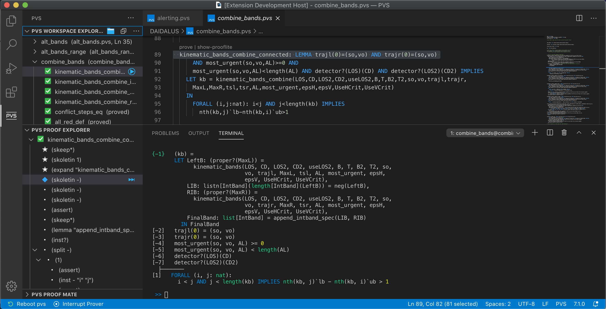
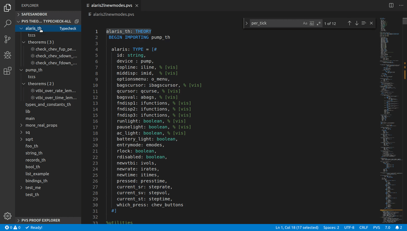

# VSCode-PVS: An Integrated Development Environment for the Prototype Verification System
VSCode-PVS is a new integrated development environment for creating, evaluating and verifying PVS specifications.
The environment redefines the way developers interact with PVS, and better aligns the PVS front-end to the functionalities provided by development environments used by software developers.

## Latest version
[vscode-pvs-1.0.24-lambda](releases/vscode-pvs-1.0.24-lambda.vsix)

## Getting started
New to VSCode-PVS and the PVS verification system? Try out our [tutorial](vscode-pvs/docs/TUTORIAL.md)!

## Functionalities
The main functionalities provided by the environment are as follows:
- **Syntax highlighting**: PVS keywords and library functions are automatically highlighted.
- **Autocompletion and code snippets**: Tooltips suggesting function names and language keywords are automatically presented in the editor when placing the mouse over a symbol name. Code snippets are provided for frequent modeling blocks, e.g., if-then-else. 
  

- **Hover information for symbol definitions**: Hover boxes providing information about identifiers are automatically displayed when the user places the cursor over an identifier.
  

- **Go-to definition**: Click on the name of the identifier while holding down the Ctrl key to jump to the location where the identifier is declared.
  

- **Live diagnostics**: Parsing is automatically performed in the background, and errors are reported in-line in the editor. Problematic expressions are underlined with red wavy lines. Tooltips presenting the error details are shown when the user places the cursor over the wavy lines.
  

- **Workspace Explorer**: Interactive tree view showing all theories in the current workspace, name and status of theorems and typecheck conditions.
  

- **Proof Explorer + Integrated Terminal**: Interactive tree view for viewing and editing the current proof. An integrated terminal allows interaction with the theorem prover. Auto-completion is provided (using the TAB key) for prover commands, as well as access to the commands history.
  

## Requirements
- Visual Studio Code (v1.32.3 or greater) https://code.visualstudio.com
- NodeJS (v12.16.1 or greater) https://nodejs.org/en/download
- Java JDK (v1.8 or greater) https://openjdk.java.net
- PVS Allegro (v7.1 or greater)
  - [PVS-7.1.0 for Linux](http://www.csl.sri.com/users/owre/drop/pvs-snapshots/pvs7.1-0-gf53d987d-ix86_64-Linux-allegro.tgz)
  - [PVS-7.1.0 for MacOs](http://www.csl.sri.com/users/owre/drop/pvs-snapshots/pvs7.1-0-gf53d987d-ix86-MacOSX-allegro.tgz) 

## Installation instructions
1. Download the latest release of VSCode-PVS from the [github repository](releases)
2. Install VSCode-PVS in Visual Studio Code: `View` -> `Extensions` -> `...` -> `Install from VSIX` -> Select the downloaded `.vsix` file
3. Have fun using the extension!

## Troubleshooting
Having troubles with the extension? Check our [FAQs](vscode-pvs/docs/FAQ.md).

## Updating VSCode-PVS
When a new release of VSCode-PVS is available in the [github repository](releases), download the new release and install it in Visual Studio Code:

- `View` -> `Extensions` -> `...` -> `Install from VSIX` -> Select the downloaded `.vsix` file

All settings and preferences from the previous version of VSCode-PVS will be maintained.

## Publications
Paolo Masci and César Muñoz, [An Integrated Development Environment for the Prototype Verification System](https://dx.doi.org/10.4204/EPTCS.310.5), Electronic Proceedings in Theoretical Computer Science (EPTCS), Vol. 310, pp. 35-49, 2019 [[PDF](https://arxiv.org/pdf/1912.10632v1)]

## Notices
### Copyright 
Copyright 2019 United States Government as represented by the Administrator of the National Aeronautics and Space Administration. All Rights Reserved.
 
### Disclaimers
**No Warranty**: THE SUBJECT SOFTWARE IS PROVIDED "AS IS" WITHOUT ANY
  WARRANTY OF ANY KIND, EITHER EXPRESSED, IMPLIED, OR STATUTORY,
  INCLUDING, BUT NOT LIMITED TO, ANY WARRANTY THAT THE SUBJECT SOFTWARE
  WILL CONFORM TO SPECIFICATIONS, ANY IMPLIED WARRANTIES OF
  MERCHANTABILITY, FITNESS FOR A PARTICULAR PURPOSE, OR FREEDOM FROM
  INFRINGEMENT, ANY WARRANTY THAT THE SUBJECT SOFTWARE WILL BE ERROR
  FREE, OR ANY WARRANTY THAT DOCUMENTATION, IF PROVIDED, WILL CONFORM TO
  THE SUBJECT SOFTWARE. THIS AGREEMENT DOES NOT, IN ANY MANNER,
  CONSTITUTE AN ENDORSEMENT BY GOVERNMENT AGENCY OR ANY PRIOR RECIPIENT
  OF ANY RESULTS, RESULTING DESIGNS, HARDWARE, SOFTWARE PRODUCTS OR ANY
  OTHER APPLICATIONS RESULTING FROM USE OF THE SUBJECT SOFTWARE.
  FURTHER, GOVERNMENT AGENCY DISCLAIMS ALL WARRANTIES AND LIABILITIES
  REGARDING THIRD-PARTY SOFTWARE, IF PRESENT IN THE ORIGINAL SOFTWARE,
  AND DISTRIBUTES IT "AS IS."
 
**Waiver and Indemnity**: RECIPIENT AGREES TO WAIVE ANY AND ALL CLAIMS
  AGAINST THE UNITED STATES GOVERNMENT, ITS CONTRACTORS AND
  SUBCONTRACTORS, AS WELL AS ANY PRIOR RECIPIENT.  IF RECIPIENT'S USE OF
  THE SUBJECT SOFTWARE RESULTS IN ANY LIABILITIES, DEMANDS, DAMAGES,
  EXPENSES OR LOSSES ARISING FROM SUCH USE, INCLUDING ANY DAMAGES FROM
  PRODUCTS BASED ON, OR RESULTING FROM, RECIPIENT'S USE OF THE SUBJECT
  SOFTWARE, RECIPIENT SHALL INDEMNIFY AND HOLD HARMLESS THE UNITED
  STATES GOVERNMENT, ITS CONTRACTORS AND SUBCONTRACTORS, AS WELL AS ANY
  PRIOR RECIPIENT, TO THE EXTENT PERMITTED BY LAW.  RECIPIENT'S SOLE
  REMEDY FOR ANY SUCH MATTER SHALL BE THE IMMEDIATE, UNILATERAL
  TERMINATION OF THIS AGREEMENT.

## Contacts
* Paolo Masci (NIA) (paolo.masci@nianet.org)
* Cesar Munoz (NASA LaRC) (cesar.a.munoz@nasa.gov)

