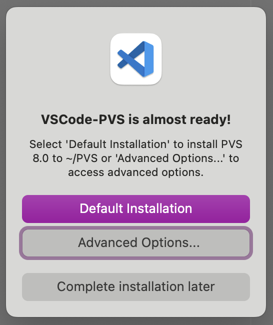
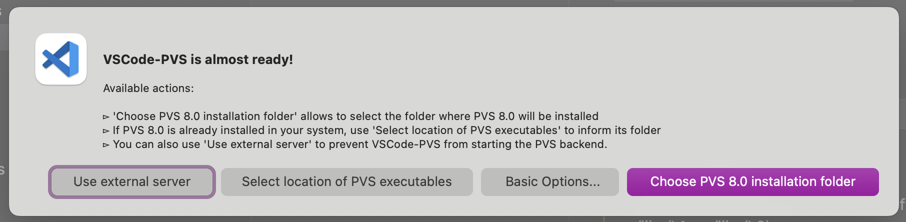
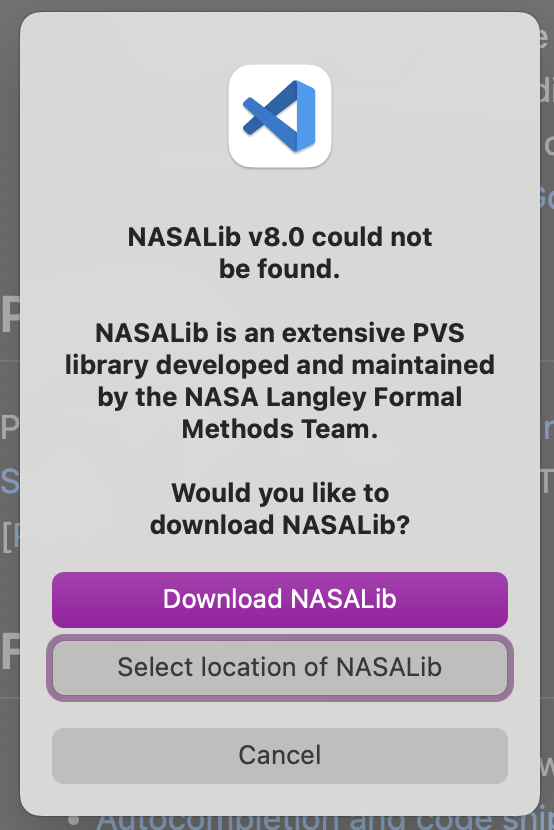

This page contains instructions on how to install nighty builds of the VSCode-PVS extension.
Please, be careful and note that these versions are usually **highly experimental**.
Use them defensively and be prepared for unexpected fails.

# VSCode-PVS for PVS 8.0 on a Mac Computer

## Prerequisites

The basic requirements for this extension are:
* NodeJS (v12.16.1 or greater) https://nodejs.org/en/download/package-manager
* Visual Studio Code (v1.49.0 or greater) https://code.visualstudio.com

## Installing the Extension

1. Download the .vsix file of VSCode-PVS from [here](./).
2. Click on the Extensions icon in the Activity Bar
3. Click on the `...` menu in the title bar, and use `Install from VSIX` to select the downloaded .vsix file

    

4. PVS 8.0: On start, VSCode-PVS will show the following pop-up.

   
 
   a. If you already have PVS 8.0 installed in your system, choose the option "Advanced Options...". Then, VSCode-PVS will show the pop-up depicted below, where you must choose "Select location of PVS 8.0 executables" and find the folder where PVS 8.0 is installed in your system.

   

   b. Alternatively, if you don't have PVS 8.0 installed in your computer, follow these steps:

      * Install Emacs (version 19 or newer): we recommend to use Aquamacs, which can be installed by typing `brew install aquamacs` in a terminal shell. If you don't have Homebrew installed, you can download it from [here](https://brew.sh/).

      * Install some Common Lisp framework, for example, SBCL; the easiest way to get SBCL is via brew: `brew install sbcl`.
      
      * Finally, click on "Default Installation" in the first pop-up.

5. NASALib: after checking PVS is installed, VSCode-PVS will ask if you want to install the NASA Library (NASALib).

   

   a. If you already have NASALib installed, click on "Select location of NASALib",

   b. otherwise, click on "Download NASALib".
