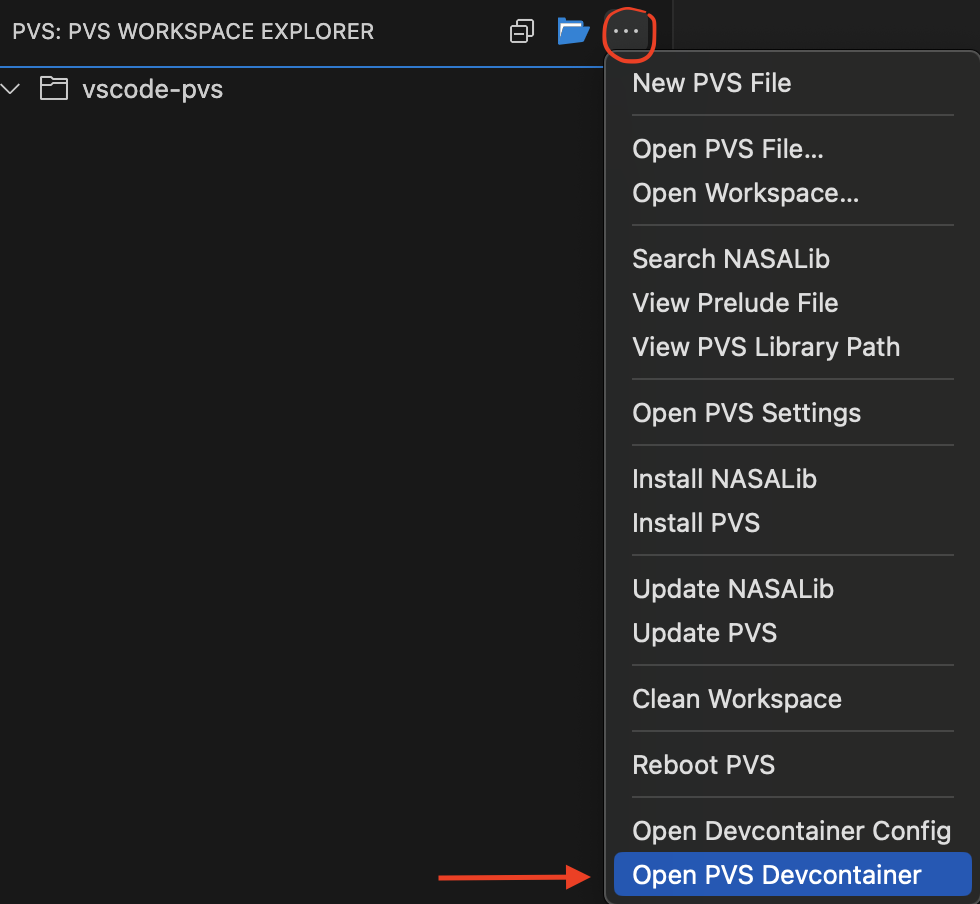
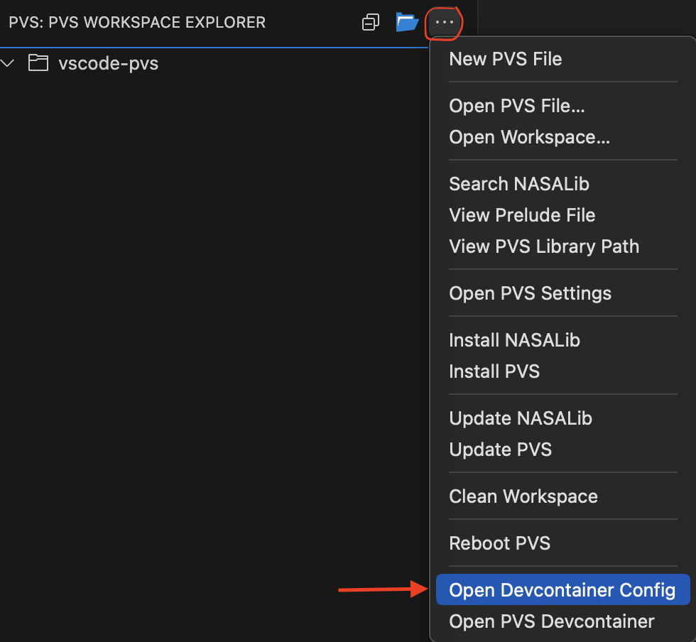

# Setting Up Docker and Dev Containers Extension in VS Code

This guide will walk you through the steps to install Docker and the Dev Containers extension for Visual Studio Code and how to use it along with pvs-vscode extension.

## Prerequisites

- A computer running a supported operating system (Windows, macOS, or Linux) for Docker.
- Visual Studio Code installed.

## Step 1: Install Docker

### Windows

1. Download Docker Desktop for Windows from the [Docker Hub](https://www.docker.com/products/docker-desktop).
2. Run the installer and follow the on-screen instructions.
3. After the installation is complete, start Docker Desktop.
4. Docker Desktop will start automatically when you log in. You can verify that Docker Desktop is running by looking for the Docker icon in the notification area.

### macOS

1. Download Docker Desktop for Mac from the [Docker Hub](https://www.docker.com/products/docker-desktop).
2. Open the downloaded `.dmg` file and drag the Docker icon to the Applications folder.
3. Open Docker from the Applications folder.
4. Docker Desktop will start automatically when you log in. You can verify that Docker Desktop is running by looking for the Docker icon in the menu bar.

### Linux

1. Update your existing list of packages:
    ```bash
    sudo apt update
    ```
2. Install a few prerequisite packages which let apt use packages over HTTPS:
    ```bash
    sudo apt install apt-transport-https ca-certificates curl software-properties-common
    ```
3. Add the GPG key for the official Docker repository to your system:
    ```bash
    curl -fsSL https://download.docker.com/linux/ubuntu/gpg | sudo apt-key add -
    ```
4. Add the Docker repository to APT sources:
    ```bash
    sudo add-apt-repository "deb [arch=amd64] https://download.docker.com/linux/ubuntu $(lsb_release -cs) stable"
    ```
5. Update the package database with the Docker packages from the newly added repo:
    ```bash
    sudo apt update
    ```
6. Make sure you are about to install from the Docker repo instead of the default Ubuntu repo:
    ```bash
    apt-cache policy docker-ce
    ```
7. Install Docker:
    ```bash
    sudo apt install docker-ce
    ```
8. Docker should now be installed, the daemon started, and the process enabled to start on boot. Check that it's running:
    ```bash
    sudo systemctl status docker
    ```

## Step 2: Install Dev Containers Extension

1. Open Visual Studio Code.
2. Go to the Extensions view by clicking the Extensions icon in the Activity Bar on the side of the window or by pressing `Ctrl+Shift+X`.
3. In the search box, type `Dev Containers`.
4. Find the extension named `Dev Containers` and click the `Install` button.

## Step 3: Verify the Installation

1. Open a new terminal in Visual Studio Code.
2. Verify Docker installation by running:
    ```bash
    docker --version
    ```
3. Verify the Dev Containers extension is installed by checking the Extensions view for the `Dev Containers` extension.

Now you have Docker and the Dev Containers extension installed and configured in Visual Studio Code. You can start using Dev Containers to develop inside a containerized environment.

## Using Dev Containers with pvs-vscode Extension

PVS executables are only available for macOS (x86-64) and Linux OS, thus limiting the use of the pvs-vscode extension to users of those OS. With the help of the Dev Containers extension, we can now enable the usage of the pvs-vscode extension in almost all OS that support Docker, including Windows and macOS (Apple Silicon).

- To use the pvs-vscode extension in a devcontainer, you first need to open a workspace that contains some `.pvs` files. The extension will automatically detect a PVS workspace and add a default `.devcontainer.json` config file which will help to set up the Docker container without any input from the user.
- As the default config is added automatically for you in PVS workspaces, you just have to open your current workspace in a devcontainer. To do this, go to the PVS Workspace Explorer panel and click the "Views and More Actions" ('...' 3-dot button on the rightmost side of the panel) and click "Open PVS Devcontainer" from the dropdown.

- While the default config should be sufficient to run PVS, if in the future you want to update it, you can click "Open Devcontainer Config" from the same dropdown to open the config file.


### Additional Information

- Inside your devcontainer, only the workspace for which you opened the devcontainer will be accessible. Docker mounts/binds the workspace files to the Docker container, which also means that your files are always in sync. Any changes made in `.pvs` or any other file while working inside the devcontainer will be reflected instantaneously in local files on your machine too.
- The extension will create separate devcontainers for separate workspaces/folders.
- The pvs-vscode extension will be automatically installed in the devcontainer. When a devcontainer has been created for the first time for a workspace, you will need to setup pvs-vscode extension like setting path to download pvs executables,etc (same process as installing on local machine). Make note that the path you set for pvs library, nasa library inside a devcontainer is home directory path for the container or inside it, otherwise you will get permission errors.
- If you need more extensions to be installed inside it, you can add them in the devcontainer config file by editing the config file as shown in previous instructions or by going to the Extensions panel in VS Code when running VS Code in a devcontainer and installing the appropriate extensions.

## Additional Resources

- [Docker Documentation](https://docs.docker.com/)
- [Dev Containers Documentation](https://code.visualstudio.com/docs/remote/containers)
