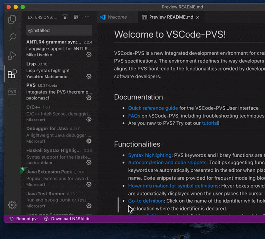
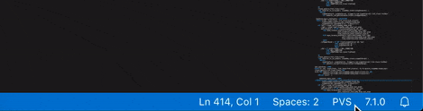
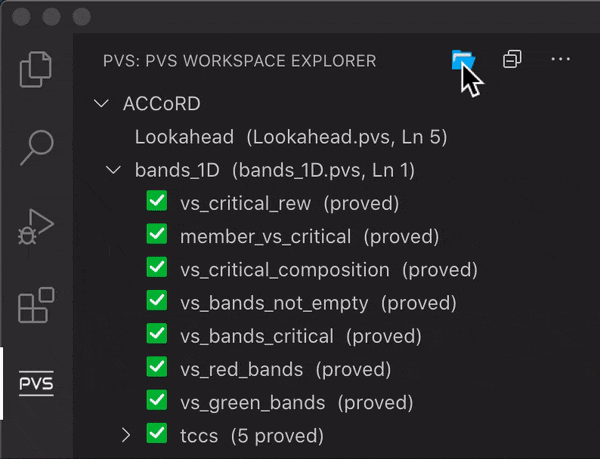

# **VSCode-PVS FAQ**
This document contains answers to common questions on VSCode-PVS, including troubleshooting techniques for basic problems.

If you don't find an answer to your question here, please check on the [PVS group on Google](https://groups.google.com/g/pvs-group) and [github](https://github.com/nasa/vscode-pvs/issues).

 

## General questions

### **Q1: Which OS is supported?**
VSCode-PVS currently runs on Linux and Intel MacOS. For other operating systems, you will need to install the extension in a virtual machine with Linux.

### **Q2: How do I start VSCode-PVS?**
VSCode-PVS will automatically start with Visual Studio Code.
If this is not happening, please go through the following checklist, to make sure you have installed all dependencies necessary to run VSCode-PVS:
- [NodeJS](https://nodejs.org/en/download) (v12.16.1 or greater) is installed
- [Java JDK](https://openjdk.java.net) (v1.8 or greater) is installed
- [PVS Allegro](http://www.csl.sri.com/users/owre/drop/pvs-snapshots) (v7.1.0 or greater) is installed
- [VSCode-PVS](https://github.com/nasa/vscode-pvs) is installed and enabled in Visual Studio Code

### **Q3: I'm new to PVS, is there a tutorial I can use to get started?**
Yes, you we have a [tutorial](TUTORIAL.md) on VSCode-PVS, that introduces the basics functions of PVS, and a [NASA PVS Class](https://shemesh.larc.nasa.gov/PVSClass2012/) and a [PVS Tutorial@CADE-18](http://precisa.nianet.org/pvs-cade-2021/), which cover a broader range of topics.

### **Q4: I'm not familiar with Visual Studio Code, is there a quick tutorial?**
Yes, you can find tutorials on the Visual Studio Code website, see https://code.visualstudio.com/docs/editor/codebasics

### **Q5: What is NASALib and how do I install it?**
NASALib is an extensive PVS library developed and maintained by the NASA Langley Formal Methods Team.

To install NASALib in VSCode-PVS, click the `Download NASALib` button in the status bar.

  

## Troubleshooting

### **Q6: VSCode-PVS is not responding and reports PVS errors, what can I do?**
An unexpected error has occurred in PVS. 

If the system is not responding, please try to reboot PVS:
- Click on the PVS version number in the status bar.
- Click on `Reboot PVS`

 
If the system is still not responding after rebooting PVS, try to restart Visual Studio Code.

If the problem persists, please report an issue on [github](https://github.com/nasa/vscode-pvs/issues) or leave us a message in the [PVS group on Google](https://groups.google.com/g/pvs-group), we will look into it.

>Note: There is an output channel `pvs-server` in Visual Studio Code. You can use it to inspect the raw output of PVS, including errors thrown by the reasoning engine, when errors occur.

### **Q7: A proof because a pop-up message "Typechecking files necessary to prove formula" does not go away, what can I do?**
An unexpected error might have occurred while processing one of the pvs files. Please try to reboot PVS (see also Q6).

### **Q8: The terminal reports an error "node does not exist", what does it mean?**
The error indicates that one of the required software packages is not installed on your system: you need to install [NodeJS](https://nodejs.org/en/download).

### **Q9: Can I use Emacs plugins for Visual Studio Code together with VSCode-PVS?**
No, we do not recommend installing Emacs plugins in Visual Studio Code, as they may interfere with the VSCode-PVS hot-keys (see also Q14).

 

## Functionalities

### **Q10: How do I open PVS files and workspaces that are not shown in Visual Studio Code?**
The easiest way to open PVS files and workspaces is through PVS Workspace Explorer:
- Click on the `open folder` icon in the title bar of PVS Workspace Explorer
- Select the folder you want to use as workspace.

 

### **Q11: Can I develop my pvs theories on my `Desktop`, or in a sub-folder of my pvs installation folder?**
**No, that's a bad idea.** The recommended way to proceed is to create a folder `workspaces` in your home directory, and use a sub-folder of workspaces to store all the pvs files of your PVS projects.

### **Q12: Can I use the classic PVS Emacs hot-keys combinations?**
Yes, you can use most of the PVS hot-keys combinations in VSCode-PVS.

Command shortcuts are initiated with the `M-x` sequence, which is obtained by pressing the `META` key and the `x` letter simultaneously. The `META` key on Linux is the `Alt` key. On MacOS, it's usually the `option` (`⌥`) key.

- `M-x show-tccs` *(show proof obligations for the file open in the editor)*
- `M-x tc` *(typecheck the file open in the editor)*
- `M-x tcp` *(typecheck the file open in the editor and re-run all proofs in the file)*
- `M-x parse` *(parse the file open in the editor)*
- `M-x pr` *(prove formula, i.e., start an interactive prover session for the formula at the cursor location)*
- `M-x prt` *(prove theory, i.e., re-run all proofs in the current theory)*
- `M-x pri` *(prove importchain, i.e., re-run all proofs in the current theory and in the imported theories)*
- `M-x pvsio` *(start an interactive PVSio evaluator session for the theory opened in the editor)*
- `M-x show-proof-summary` *(show proof summary)*
- `M-x status-proof-chain` *(status proof chain)*
- `M-x vpf` *(view prelude file)*

Additional hot-keys provided by VSCode-PVS:
- `M-x add-pvs-library` *(adds a folder to the vscode-pvs library path)*
- `M-x pvs-library-path` *(shows the pvs library path specified in vscode-pvs settings)*
- `M-x reset-pvs-library-path` *(resets the vscode-pvs library path to empty)*
- `M-x reboot-pvs` *(reboots pvs-server)*
- `M-x clean-bin` *(removes pvsbin files created by pvs)*
- `M-x clean-tccs` *(removes .tccs files created by pvs)*
- `M-x clean-all` *(removes all temporary files (including .tccs and pvsbin) created by pvs)*
- `M-x install-pvs` *(starts as interactive wizard that allows to install or update PVS)*
- `M-x install-nasalib` *(starts an interactive wizard that allows to install NASALib)*
- `M-x update-nasalib` *(updates the installed version of NASALib)*
- `M-x set-pvs-path` *(sets the path to the PVS executables)*
- `M-x settings` *(shows vscode-pvs settings)*
- `M-x release-notes` *(shows vscode-pvs release notes)*

### **Q13: What is `M-x`, and how do I use it?**
`M-x` is a key combination obtained by pressing the `META` key and the `x` letter simultaneously.
The `META` key on Linux `Alt`. On MacOS, it's usually the `option` key.

### **Q14: Can I add external pvs libraries so that the typechecker finds them?**
Yes, you can add external libraries with the hot-key combination `M-x add-pvs-library`. This command will open a file browser that allows you to select the folder to be included. The full list of external libraries can be viewed with the command `M-x pvs-library-path`.

### **Q15: In the prover session, can I move the cursor with the mouse using point-click actions?**
Yes, point-click actions are enabled in the prover session when pressing the `META` key, where the `META` key is `Alt` on Linux, and `option` on MacOS.

### **Q17: In the prover session, can enter or copy-paste a multi-line proof commands?**
Yes, but you need enclose your multi-line proof command within round brackets.

### **Q18: Can I edit a proof tree, e.g., copy/paste proof branches?**
Yes, PVS Proof Explorer is also a proof editor. You can right click anywhere in the proof tree, and perform the following operations:
- edit proof commands
- cut/copy/paste proof commands and sub-trees
- trim proof commands
- delete proof commands and sub-trees

### **Q19: How do I save the proof?**
VSCode-PVS will automatically save the proof at the end of the prover session. If a proof is already present for the formula being proved, VSCode-PVS will ask confirmation before overwriting the old proof. 

### **Q20: Can I save multiple proofs for the same theorem?**
No, the current version of VSCode-PVS stores only one proof for each theorem.

