# VSCode-PVS User Interface
This document illustrates the layout and functionalities of VSCode-PVS, as well as tips on how to optimize the user interface and improve your user experience with VSCode-PVS and Visual Studio Code in general.

 

## Layout

The layout of VSCode-PVS includes 7 main elements.

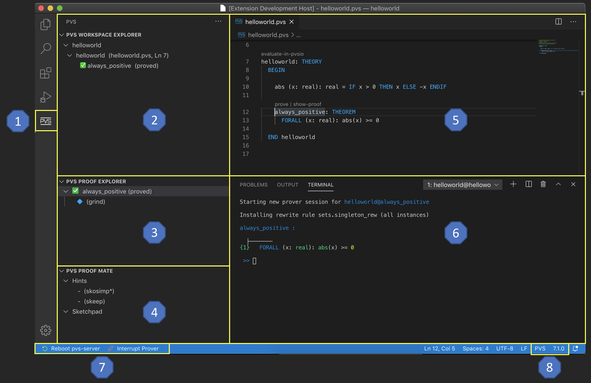

 

1. [PVS]() button. Located in the vscode activity bar, this button activates three custom views created for PVS: *Workspace Explorer*, *Proof Explorer*, and *Proof Mate*.
2. [Workspace Explorer]() view. Located in the vscode side panel, this view shows the name of the PVS theories defined in the current workspace, as well as the list of theorems defined in each theory. Contextual menus and in-line actions provide quick access to functionalities such as *typechecking* and *prove formula*.
3. [Proof Explorer]() view. Located in the vscode side panel, this view shows the proof tree for the current proof. Contextual menus and in-line actions provide quick access to functionalities such as *run proof* and *step proof*.
4. [Proof Mate]() view. Located in the vscode side panel, this view provides *hints* on proof commands that can be used to make progress with the current proof. It also contains a *sketchpad* that stores proof commands clipped from the current proof shown in Proof Explorer (e.g., when editing or repairing a proof).
5. [File Editor]() view. Located in the vscode central panel, this view allows to edit PVS files.
6. [Prover Console]() view. Located in the vscode central panel, this view provides an interactive prompt for sending proof commands to the PVS theorem prover.
7. [Quick Access]() toolbar. Located above the central editor panel, this toolbar provides convenient access to frequently used PVS functions, including: *search NASALib*, *show proof tree*, *prove formula*, *evaluate in PVSio*, *typecheck*, and *change PVS workspace*.

  

## Opening PVS files and PVS workspaces

To open a PVS file in VSCode-PVS, you need to add the folder containing the PVS file to the Visual Studio Code workspace. The simplest way to perform this operation is through the `open folder icon` located in the Quick Access toolbar of VSCode-PVS. A click on the open folder icon will open a window that allows you to select the folder containing the PVS file.

  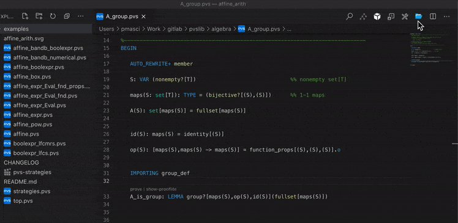
 

Once the folder is in the Visual Studio Code workspace, click on the `PVS` button to switch `Workspace Explorer`, an interactive tree view provided by VSCode-PVS that presents an overview of all theories and formulas (theorems, lemmas, TCCs, etc.) defined in the current workspace. Click on a theory to open in the Editor the PVS file where the theory is defined. Similarly, click on a formula to jump to the formula definition.

  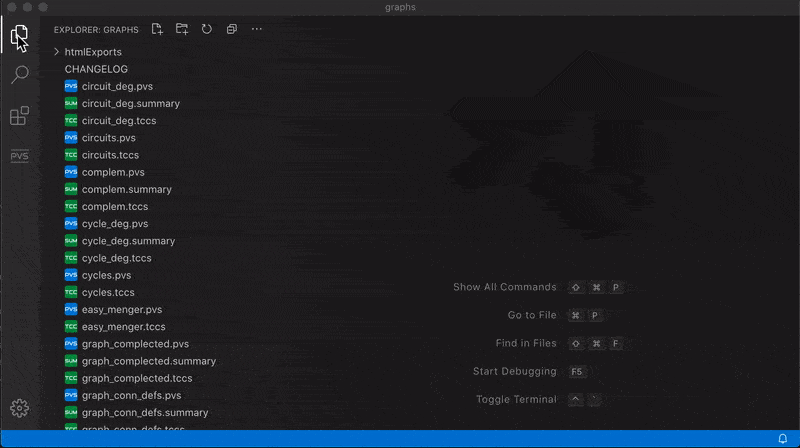

In-line actionable commands are displayed next theories and formulas in Workspace Explorer, providing convenient access to the following frequent actions:
- `Typecheck`: typecheck the selected file or theory
- `Prove`: start a new prover session for the selected formula
- `Prove-All`: re-run all proofs and creates a **summary file** providing an overview of the status of each proof. 

A left mouse click on theories and formulas shown in Workspace Explorer opens a context menu providing the following actions:
- `Typecheck file`: typechecks the selected file or theory
- `Typecheck workspace`: typechecks all files in the current workspace
- `Show Proof Summary`: shows a summary file indicating the status (proved, unfinished, untried, etc.) of each proof defined in the selected theory
- `Show Typecheck Conditions`: shows the proof obligations generated for the selected file or theory
- `Re-Run All Proofs`: re-runs all proofs defined in the selected theory
- `Re-Run ImportChain`: re-runs all proof defined in the selected theory and in the imported theories
- `Discharge TCCs`: tries to discharge all proof obligations for the selected theory
- `Evaluate in PVSio`: starts a PVSio evaluator session for the selected theory

 

## Editing PVS files

VSCode-PVS provides all features necessary to create and edit PVS files, including:

- **Syntax highlighting**: PVS keywords and library functions are automatically highlighted.
- **Autocompletion and code snippets**: Tooltips suggesting function names and language keywords are automatically presented in the editor when placing the mouse over a symbol name. Code snippets are provided for frequent modeling blocks, e.g., if-then-else. 
   

- **Hover information for symbol definitions**: Hover boxes providing information about identifiers are automatically displayed when the user places the cursor over an identifier.
   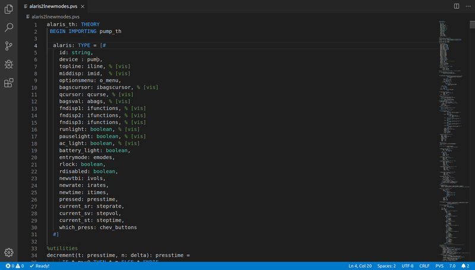

- **Go-to definition**: Click on the name of the identifier while holding down the Ctrl key to jump to the location where the identifier is declared.
   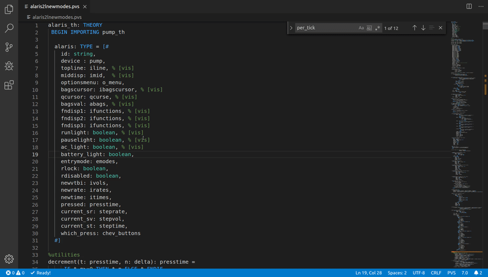

- **Live diagnostics**: Parsing is automatically performed in the background, and errors are reported in-line in the editor. Problematic expressions are underlined with red wavy lines. Tooltips presenting the error details are shown when the user places the cursor over the wavy lines.
   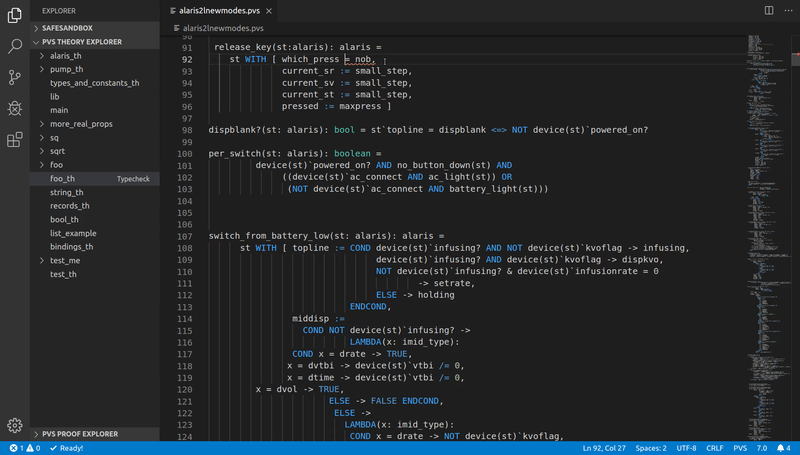

  

## Proving theorems

Interactive prover sessions can be started for each formula defined in the current PVS workspace.
To start a prover session, click the inline `prove` command next to the theorem. Alternatively
you can also click the `play` button displayed next to a formula name in `Workspace Explorer`.

  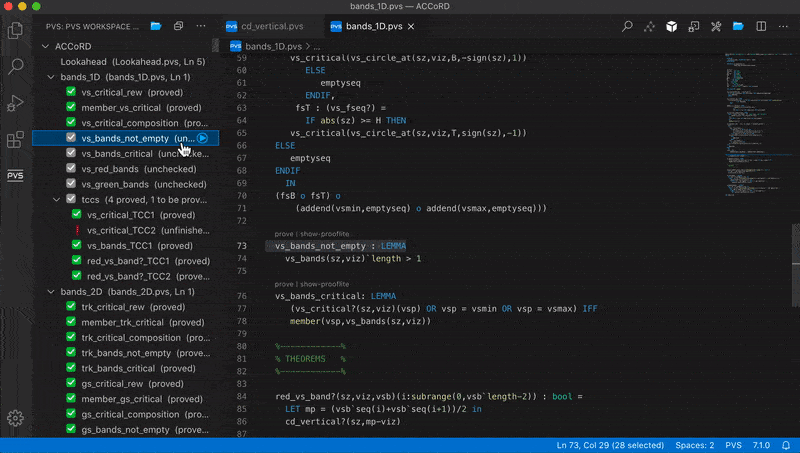

When a prover session is started, VSCode-PVS automatically activated the following components:
- `Proof Explorer`: interactive tree view for displaying, executing, and editing proof files.
- `Proof Mate`: interactive tree view providing a sketchpad and a proof command suggester.
- `Prover Console`: interactive command line console for sending proof commands to the PVS theorem prover.

 

**Proof Explorer**

Proof Explorer allows to re-run a proof, perform step-by-step execution of proof commands, fast-forward/rewind the current proof to a proof command, cut/trim/slice the proof tree, and edit proof commands.

  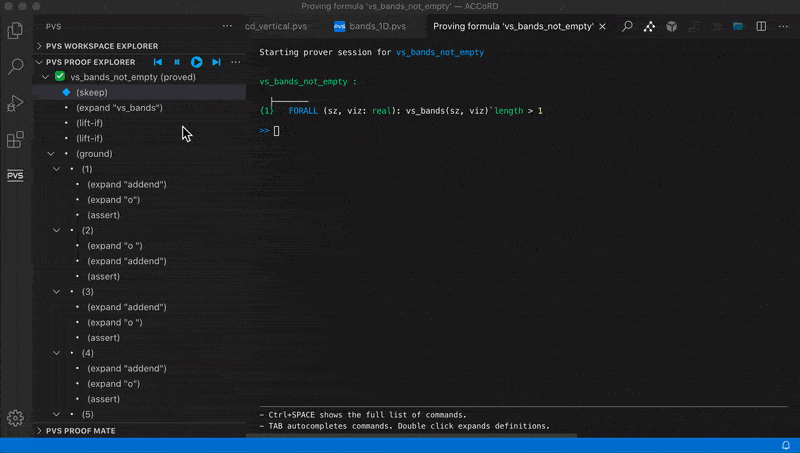

The proof is rendered as an interactive tree:
- the root of the tree is the name of the formula currently being proved.
- the icon next to the formula name is the proof status (e.g., proved, unchecked, unfinished, etc.).
- nodes in the tree represent proof commands.
- branches in the tree represent sub-goals generated by a proof command.

The icon displayed next to a proof command identifies the state of a proof command:
- blue diamond: indicates the *active command*, i.e., the proof command ready to be sent to the theorem prover.
- hollow star: indicates a *visited command*, i.e., a proof command that has already been sent to the theorem prover. 
- full star: indicates a *complete branch*, i.e., a branch that is proved and complete in the current proof. 
- bullet: indicates a proof node that has not been executed by the theorem prover, or has produced no change in the sequent.

Actions provided in the title bar include:
- *play*: re-runs the entire proof script.
- *forward*: sends the next command to the theorem prover.
- *back*: sends an *undo* command to the theorem prover.

 

**Proof Mate**

Proof Mate provides a sketchpad that automatically collects proof fragments that become detatched from the proof tree, e.g., as a consequence of cut/trim operations on the proof tree, or because a breaking change introduced in the specification. These clips facilitate proof editing and proof repair, and they can be accessed and re-used across proof sessions.

  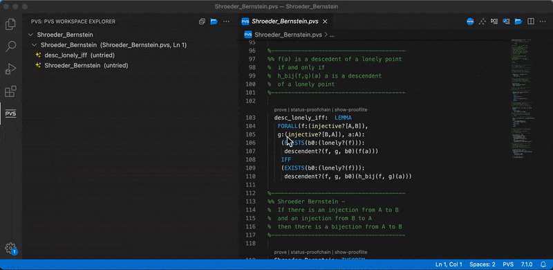

Proof Mate has also an integrated suggester that shows hints about proof commands that can be used to make progress with the current proof. This component uses only simple heuristics at the moment. More advanced heuristics will be developed over time.

 

**Prover Console**

The prover console is automatically started when starting a proof.
Proof commands can be entered at the prover prompt, and are automatically appended to the proof tree displayed in Proof Explorer.

  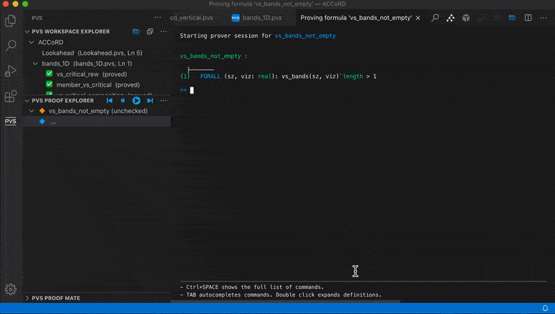

Auto-completion is provided (using the TAB key) for prover commands, as well as access to the commands history (using the ArrowUp/ArrowDown keys).

An integrated help panel shown at the bottom of the console provides useful information on the proof command being entered, including a brief description and the syntax of the proof command.

  

## Hot-Keys combinations
VSCode-PVS provides a series of hot-key combinations to access PVS commands and editor functions.

### Command Shortcuts
Command shortcuts are initiated with the `M-x` sequence, which is obtained by pressing the `META` key and the `x` letter simultaneously. The `META` key on Linux is the `Alt` key. On MacOS, it's usually the `option` (`⌥`) key.

Frequent commands:
- `M-x show-tccs` *(show proof obligations for the file open in the editor)*
- `M-x tc` *(typecheck the file open in the editor)*
- `M-x tcp` *(typecheck the file open in the editor and re-run all proofs in the file)*
- `M-x parse` *(parse the file open in the editor)*
- `M-x pr` *(prove formula, i.e., start an interactive prover session for the formula at the cursor location)*
- `M-x prt` *(prove theory, i.e., re-run all proofs in the current theory)*
- `M-x pri` *(prove importchain, i.e., re-run all proofs in the current theory and in the imported theories)*
- `M-x pvsio` *(start an interactive PVSio evaluator session for the theory opened in the editor)*
- `M-x x-show-proof` *(shows the proof tree. This command is available only when a prover session is active)*
- `M-x show-proof-summary` *(show proof summary)*
- `M-x show-prooflite` *(show prooflite script)*
- `M-x insert-prooflite-script` *(insert prooflite script at cursor position)*
- `M-x status-proof-chain` *(status proof chain)*
- `M-x vpf` *(view prelude file)*

Additional commands:
- `M-x add-pvs-library` *(add a folder to the vscode-pvs library path)*
- `M-x pvs-library-path` *(show the pvs library path specified in vscode-pvs settings)*
- `M-x reset-pvs-library-path` *(reset the vscode-pvs library path to empty)*
- `M-x reboot-pvs` *(reboot pvs-server)*
- `M-x clean-bin` *(remove pvsbin files created by pvs)*
- `M-x clean-tccs` *(remove .tccs files created by pvs)*
- `M-x clean-all` *(remove all temporary files (including .tccs and pvsbin) created by pvs)*
- `M-x install-pvs` *(install or update PVS)*
- `M-x install-nasalib` *(install NASALib)*
- `M-x update-nasalib` *(update the installed version of NASALib)*
- `M-x set-pvs-path` *(set the path to the PVS executables)*
- `M-x settings` *(show vscode-pvs settings)*
- `M-x welcome` *(show vscode-pvs welcome screen)*

 

### Editor Shortcuts
Editor shortcuts do not require an initialization sequence, and most of them are key bindings pre-defined in Visual Studio Code. 

[Linux](https://code.visualstudio.com/shortcuts/keyboard-shortcuts-linux.pdf)
- `ctrl f ` *(find in file)*
- `ctrl shift f ` *(find in workspace)*
- `ctrl | ` *(split screen)*

- `ctrl / ` *(comment selected lines)*
- `ctrl alt / ` *(comment as inline prooflite script)*

- `ctrl shift p ` *(command palette)*
- `ctrl shift l ` *(add more cursors at each occurrence of the current selected text)*
- `ctrl alt ↓ ` *(add a cursor at the line below)*

 

[MacOS](https://code.visualstudio.com/shortcuts/keyboard-shortcuts-macos.pdf)
- `⌘ f ` *(find in file)*
- `⌘ ⇧ f ` *(find in workspace)*
- `⌘ | ` *(split screen)*

- `⌘ / ` *(comment selected lines)*
- `⌘ ^ / ` *(comment as inline prooflite script)*

- `⌘ ⇧ p ` *(command palette)*
- `⌘ ⇧ l ` *(add more cursors at each occurrence of the current selected text)*
- `⌘ ⌥ ↓ ` *(add a cursor at the line below)*

  

## Survival Tips
The following tips can improve your user experience with VSCode-PVS and, in general, with Visual Studio Code.

1. If you are not too familiar with the Visual Studio Code environment, please read the [User Interface Guide](https://code.visualstudio.com/docs/getstarted/userinterface)

2. Check our answers to [Frequently Asked Questions](FAQ.md)

3. Optimize the `activity bar`. PVS users may want to consider hiding the following functions: `Accounts`, `Source Control`, and `Run`. See also [guidance on how to hide/reveal/reorder items in the activity bar](https://code.visualstudio.com/docs/getstarted/userinterface#_activity-bar).
   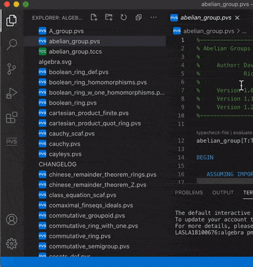

4. Optimize the `status bar`. PVS users may want to consider hiding the following functions: `Problems`, `Editor Encoding`, `Editor End of Line`, `Tweet Feedback`.
   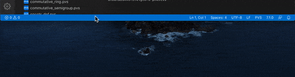

5. Select a color theme that feels comfortable for your eyes. Visual Studio Code uses a `dark theme` by default. If you prefer a `light theme`, you can select it from the settings menu. See also [guidance on how to change the color theme](https://code.visualstudio.com/docs/getstarted/themes#_selecting-the-color-theme).
   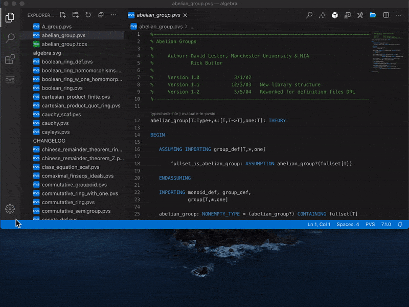
